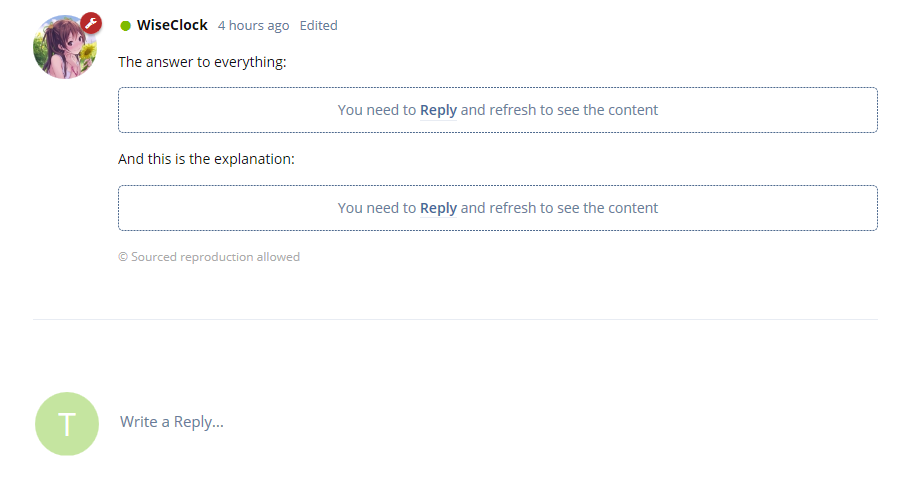
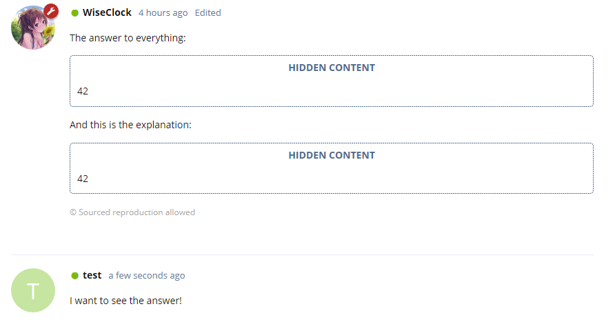

# Reply 2 See


## Explanation

This Extension is powered by [WiseClock](https://github.com/WiseClock/flarum-ext-reply2see), and updated by [nosun](https://github.com/nosun/flarum-ext-reply2see), but after flarum v1.2, the extension can not be used. so I upgrade it, now it can run under flarum v1.2

## About This Extension

A Flarum extension. Adds a reply to see BBCODE.

Note that it only works for the main post (the start post of a discussion) because I don't think it makes sense to ask people replying to a comment post to see it's content. This BBCode will be replaced by div in comment posts.

## How to

When creating/editing a post, you can simply use the [reply] BBCode to make it hidden to other users until they've replied.

```bbcode
[reply]Here goes the content[/reply]
```

## Screenshots

- Before:
  

- After:
  

## Installation

install manually with composer:

```bash
composer require littlecxm/flarum-reply-to-see
```

Updating

```bash
composer update littlecxm/flarum-reply-to-see
php flarum cache:clear
```

## Links

- [Packagist](https://packagist.org/packages/nosun/reply-to-see)
- [GitHub](https://github.com/nosun/flarum-ext-reply2see)
